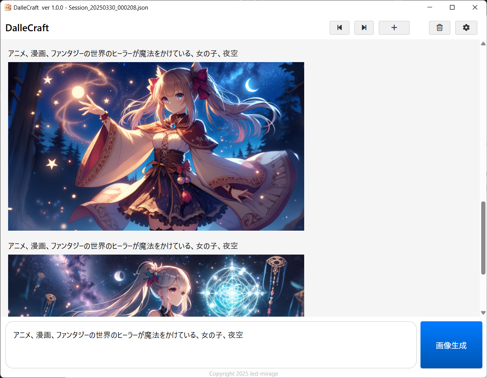

#  DalleCraft クイックスタートガイド

Copyright (c) 2025 led-mirage

## 💎 この資料について

この資料ではOpenAIのAPIを利用する場合の手順を簡単に紹介します。

## 💎 スクリーンショット

## 💎 事前準備

- [OpenAI Platform](https://platform.openai.com/docs/overview)に登録し、APIキーを発行し、任意の金額を課金してください。
- 詳細はネットの情報を参考にしてください。[この記事](https://note.com/yon4987/n/n5d2f0bd3356c)が参考になると思います。

## 💎 インストール

1. このツールを配置するディレクトリを作成します。
2. [Releasesページ](https://github.com/led-mirage/DalleCraft/releases)からZIPファイルをダウンロードして、作成したディレクトリに解凍します。

## 💎 設定

- OSの環境変数にOPENAI_API_KEYを追加し、APIキーを設定してください。
- Windowsの場合、`環境変数の編集`で検索すると設定画面が出てきます。

## 💎 実行

DalleCraft.exeをダブルクリックして起動します。

## 💎 DALL·E 3 APIの利用料金

DALL·E 3 API利用料金は[OpenAIの公式サイト](https://platform.openai.com/docs/pricing#image-generation)でご確認ください。

生成画像１枚毎に課金され、画像サイズ、品質によって料金が異なります。
