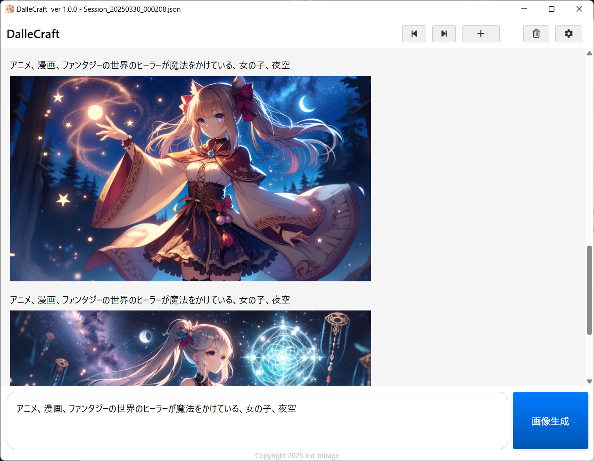
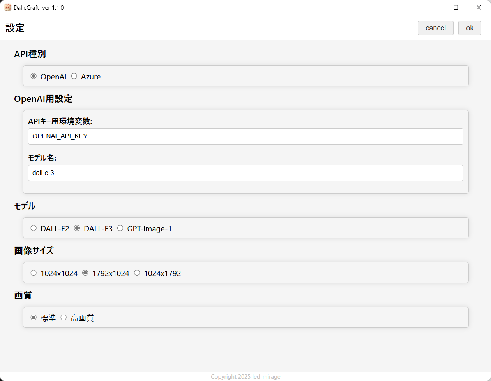

#  DalleCraft

[](https://github.com/led-mirage/DalleCraft/releases)
[](https://github.com/led-mirage/DalleCraft/releases)
[](LICENSE)

Copyright (c) 2025 led-mirage

## 💎 概要

DalleCraft（ダリ・クラフト）は、OpenAI 画像生成APIを利用した画像生成アプリケーションです。

OpenAI API、Azure OpenAI Serviceに対応しています。

手早く開始したい方は、[クイックスタートガイド](QuickStart.md)をご参照ください。

<div class="page"/>

## 💎 スクリーンショット

<br>

<br>

<div class="page"/>

## 💎 特徴

このアプリはAIを使って手軽に高画質な画像を作りたい人、高性能なPCを持っていない人にとって便利なツールです。

### メリット

- 高画質な画像を手軽に生成できます。
- 高性能なPCは必要ありません。
- セッションごとに画像が保存されるので、画像の管理がしやすいです。
- 過去のセッションの画像の閲覧が可能です。

### デメリット

- APIの利用料金が発生します。※本アプリ自体は無料です。

※ DALL-E3を無料で楽しみたい方は、Microsoft CopilotやBing Image Creatorなどを使うと、無料で画像生成ができます。ただ、無料版だと解像度が1024x1024に固定されるなどの制約があるようです。詳しくはMicrosoftのサイトで確認してください。

## 💎 ご協力のお願い

バージョン1.1.0で`GPT Image 1`モデルの対応は実装済みですが、`Verify organization`未完了のため当方では実動作確認ができていません。

もし認証済みのOpenAIアカウントをお持ちの方がいらっしゃいましたら、動作確認を試していただけると大変助かります。

ご使用後、動作状況などをご報告いただけると幸いです🥺  
（Issue や Discussion への投稿歓迎です！）

## 💎 事前準備

### APIキーの取得

### 📌 OpenAIを使用する場合

- [OpenAI Platform](https://platform.openai.com/docs/overview)に登録し、APIキーを発行してください。

### 📌 Azure OpenAI Serviceを使用する場合

- Azure OpenAI Serviceのリソースを作成し、APIキーとエンドポイントを取得してください。くわえて、dall-e-3モデルをAzure上でデプロイしてください。
- 2025年3月現在、日本リージョンではdall-e-3モデルをデプロイできないようです。動作確認にはeastusリージョンを使用しました。
- デプロイ可能なリージョンは[Microsoftの公式サイト](https://learn.microsoft.com/ja-jp/azure/ai-services/openai/concepts/models?tabs=standard%2Cstandard-chat-completions#models-by-deployment-type)でご確認ください。

<div class="page"/>

## 💎 インストール

## 📌 実行ファイル（DalleCraft.exe）を使う場合

1. このツールを配置するディレクトリを作成します。
2. [Releasesページ](https://github.com/led-mirage/DalleCraft/releases)からZIPファイルをダウンロードして、作成したディレクトリに解凍します。

## 📌 Pythonで実行する場合

1. プロジェクト用ディレクトリを作成し、移動します。
2. GitHubからソースを取得します：
    ```
    git clone https://github.com/led-mirage/DalleCraft.git
    ```
3. 仮想環境を作成し、アクティベートします（推奨）：
    ```
    python -m venv venv
    .\venv\scripts\activate
    ```
4. 必要なライブラリの取得します：
    ```
    pip install -r requirements.txt
    ```

## 💎 設定

### 📌 OpenAIを使用する場合

- OSの環境変数にOPENAI_API_KEYを追加し、APIキーを設定してください。
- 使用する環境変数名はアプリの設定画面から変更できます。

### 📌 Azure OpenAI Serviceを使用する場合

- OSの環境変数にAZURE_OPENAI_API_KEYを追加し、APIキーを設定してください。
- OSの環境変数にAZURE_OPENAI_ENDPOINTを追加し、エンドポイントを設定してください。
- 使用する環境変数名はアプリの設定画面から変更できます。
- アプリの設定画面でデプロイしたモデル名を設定してください。

<div class="page"/>

## 💎 実行方法

📌 実行ファイル（DalleCraft.exe）を使う場合

DalleCraft.exeをダブルクリックして起動します。

📌 Pythonで実行する場合

以下のコマンドを実行します。
```
python src/main.py
```

## 💎 DALL-E3 APIの利用料金

DALL-E3 API利用料金は[OpenAIの公式サイト](https://platform.openai.com/docs/pricing#image-generation)でご確認ください。Azure OpenAI Serviceを利用する場合は、[Microsoftの公式サイト](https://azure.microsoft.com/en-us/pricing/details/cognitive-services/openai-service/)でご確認ください。

生成画像１枚毎に課金され、画像サイズ、品質によって料金が異なります。

## 💎 注意事項

## ウィルス対策ソフトの誤認問題

このプログラムの実行ファイル（DalleCraft.exe）はウィルス対策ソフトにマルウェアと誤認されることがあります。

もちろん、このアプリに悪意のあるプログラムは入っていませんが、気になる人は上記の「Pythonで実行する場合」で実行してください。

誤認問題が解決できるのが一番いいのですが、いい方法が見つかっていないので申し訳ありませんがご了承ください。

VirusTotalでのチェック結果は[ここ](https://www.virustotal.com/gui/file/f0dfcafad5fd15b876915e48663a8e091d7b842cee3f07bef2460ef52d34c678?nocache=1)で確認できます（2025/06/08 v1.1.1）

72個中3個のアンチウィルスエンジンで検出

<div class="page"/>

## 💎 使用しているライブラリ

### 🔖 pywebview 5.4
ホームページ： https://github.com/r0x0r/pywebview  
ライセンス：  BSD-3-Clause license  

### 🔖 openai 1.84.0
ホームページ： https://github.com/openai/openai-python  
ライセンス： Apache License 2.0  

### 🔖 pillow 11.1.0
ホームページ： https://github.com/python-pillow/Pillow  
ライセンス： MIT-CMU License  

### 🔖 Font Awesome Free 6.7.2
ホームページ：https://fontawesome.com/  
ライセンス：Icons: CC BY 4.0, Fonts: SIL OFL 1.1, Code: MIT License

### 🔖 PyInstaller 6.14.0
ホームページ： https://github.com/pyinstaller/pyinstaller  
ライセンス： GPL 2.0 License / Apache License 2.0  

## 💎 ライセンス

© 2025 led-mirage

本アプリケーションは MITライセンス の下で公開しています。詳細については、プロジェクトに含まれる LICENSE ファイルをご参照ください。

<div class="page"/>

## 💎 バージョン履歴

### 1.1.1 (2025/06/08)

- Hotfix: Azure OpenAI Serviceでの画像生成ができないバグを修正

### 1.1.0 (2025/06/08)

- GPT Image 1モデルに対応
- openaiライブラリのバージョンを1.84.0に更新
- PyInstallerのバージョンを6.14.0に更新

### 1.0.1 (2025/05/17)

- リファクタリングのみ（機能の追加、変更はありません）
    - Applicationクラスのスリム化
    - Serviceクラスの導入

### 1.0.0 (2025/03/30)

- ファーストバージョン
